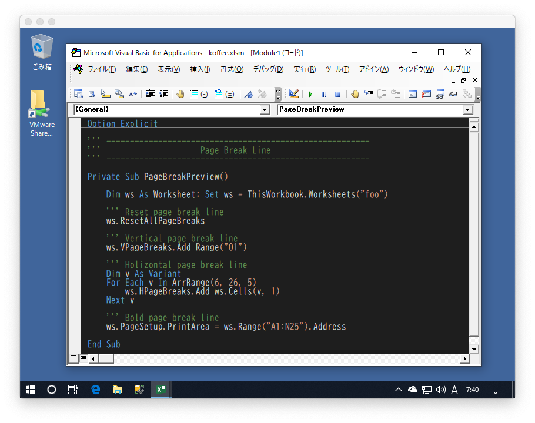
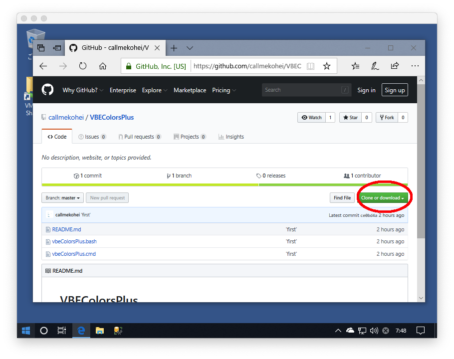
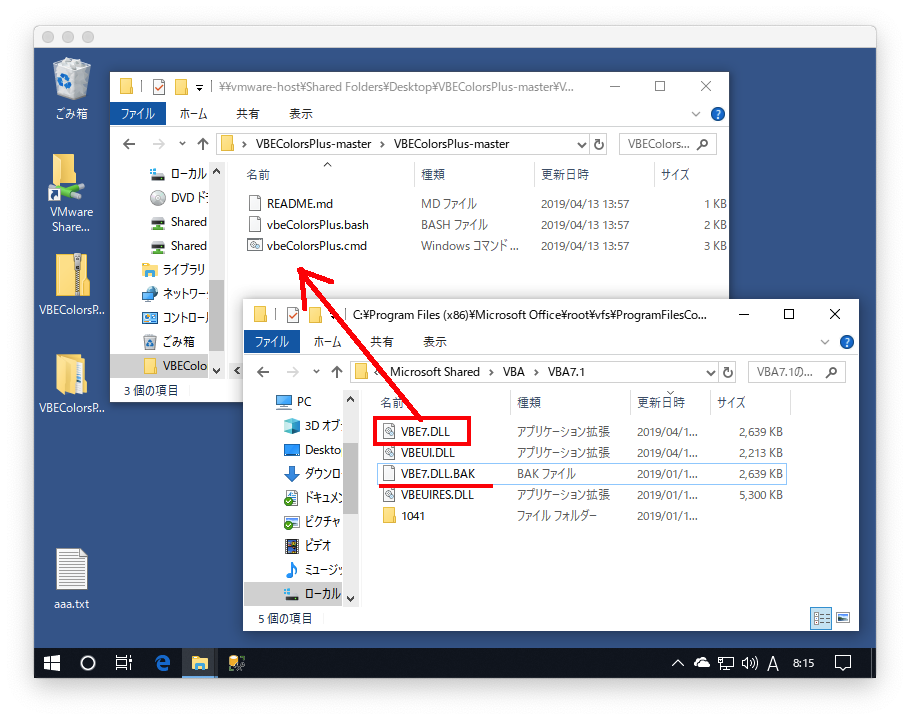
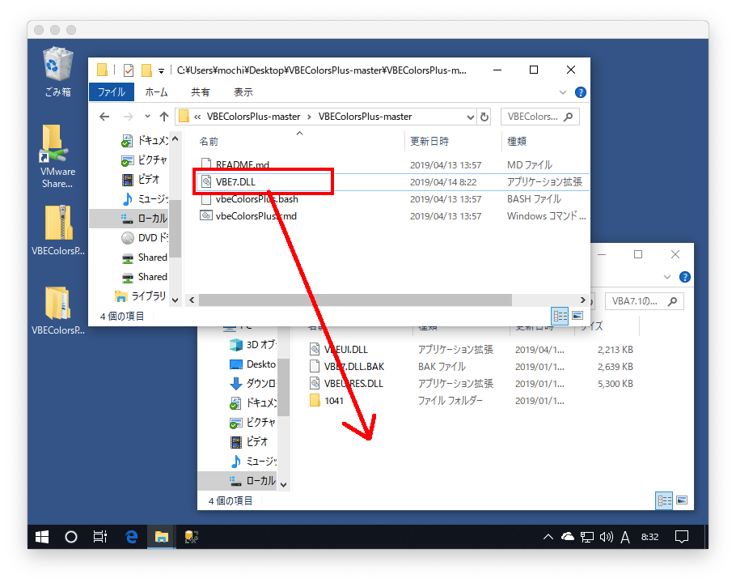
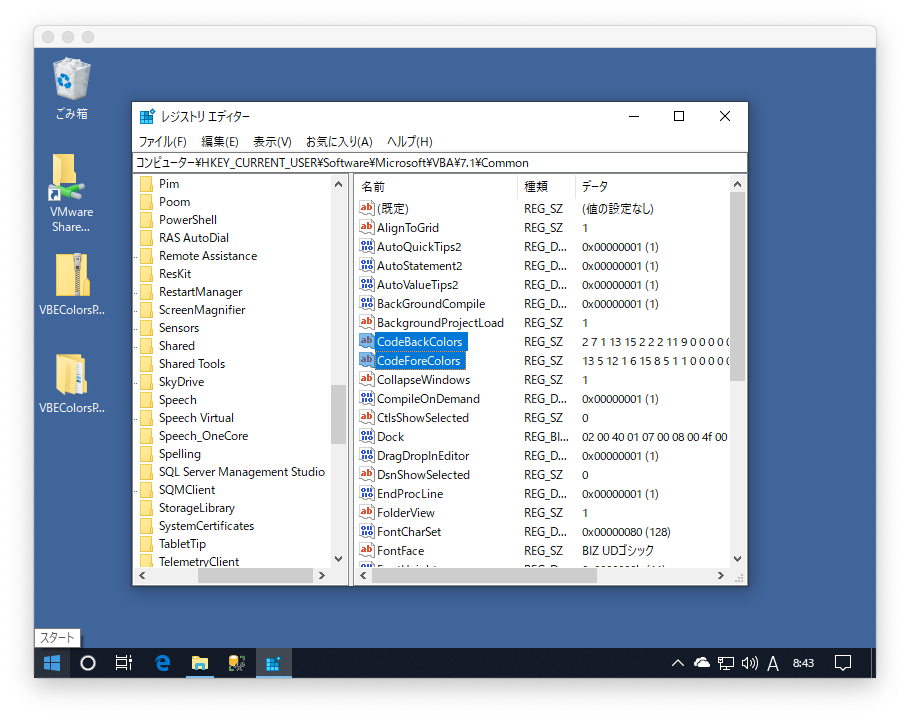
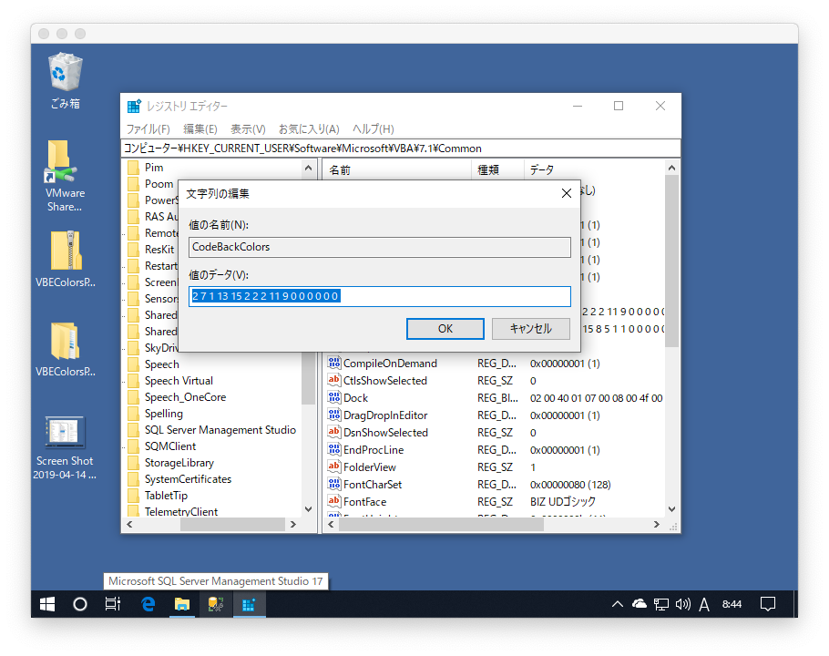

# VBEColorsPlus




`VBEColorsPlus`は`VBE`の見た目を改善するスクリプトです。

[dimitropoulos/VBECustomColors](https://github.com/dimitropoulos/VBECustomColors)を参考に作成したスクリプトです。

## 使い方

### 1. デスクトップにスクリプトをダウンロードします



### 2. `Zip`を解凍したフォルダにプログラムフォルダの`VBE7.DLL`をコピーします



```
1. プログラムフォルダを開く（環境による）
  C:\Program Files (x86)\Microsoft Office\root\vfs\ProgramFilesCommonX86\Microsoft Shared\VBA\VBA7.1\
2. VBE7.DLLのバックアップを必ずとる
  VBE7.DLL をコピーして VBE7.DLL.BAK などとリネームする
3. VBE7.DLLを先ほど解凍したデスクトップのフォルダにコピー
```

### 3. vbeColorsPlus.cmd をダブルクリックして変更を加える

下記の文言が出たらオーケー（一瞬表示されるだけ、赤い文字が出なければオーケー）
```
入力長 = 2701976
出力長 = 5403954
CertUtil: -encodehex コマンドは正常に完了しました。
入力長 = 10807910
出力長 = 2701976
CertUtil: -decodehex コマンドは正常に完了しました。
```
ネットワークドライブの場合は`cmd.exe`にて実行

### 4. 上記の変更を加えた`VBE7.DLL`をプログラムフォルダにコピーする




```
1. ファイルを置き換える
2. 管理者権限で続行を選択する
```

エクセルのプロセスが生きてるとコピーできないのでエクセルを落とすこと  
タスクマネジャーにてプロセスを確認できるので  
エクセルのプロセスが生きている場合は落とすこと

<br>

## 色設定ファイルを変更する

### レジストリエディタを立ち上げる

`Win + R` で  `ファイル名を指定して実行` プログラムを立ち上げ `regiedit` を入力しレジストリエディタを立ち上げる


### ファイルを２つ追加する





アドレスバーに下記アドレスを入力

```
コンピューター\HKEY_CURRENT_USER\Software\Microsoft\VBA\7.1\Common
```

適当なところで右クリックし`新規 > 文字列値`で下記２つのファイルを作成する
値の名前はファイル名

```
値の名前  : CodeBackColors
値のデータ: 2 7 1 13 15 2 2 2 11 9 0 0 0 0 0 0

値の名前   : CodeForeColors
値のデータ : 13 5 12 1 6 15 8 5 1 1 0 0 0 0 0 0
```

## 確認

エクセルを立ち上げて`VBE`を開き冒頭の写真のようになっていたらオーケー。

<br>
<br>
<br>


## in English


### modify VBE7.DLL

```cmd
// download VBEColorsPlus
> git clone https://github.com/callmekohei/VBEColorsPlus

// make directory
> mkdir Foo\
> cd Foo\

// copy files
> copy ..\VBEColorsPlus\vbeColorsPlus.cmd
> copy "C:\Program Files (x86)\Microsoft Office\root\vfs\ProgramFilesCommonX86\Microsoft Shared\VBA\VBA7.1\VBE7.DLL"

// modify vbe dll
> vbeColorsPlus.cmd

// open explorer
> start .
```

### backup VBE7.DLL and drag and drop modified VBE7.DLL

1. open `"C:\Program Files (x86)\Microsoft Office\root\vfs\ProgramFilesCommonX86\Microsoft Shared\VBA\VBA7.1\`
1. rename `VBE7.DLL` to `VBE7.DLL.BAK`
2. drag and drop modified `VBE7.DLL`


### color config file in registory

open `regiedit`

```
// go to following address
\HKEY_CURRENT_USER\Software\Microsoft\VBA\7.1\Common

CodeBackColors
2 7 1 13 15 2 2 2 11 9 0 0 0 0 0 0

CodeForeColors
13 5 12 1 6 15 8 5 1 1 0 0 0 0 0 0
```

